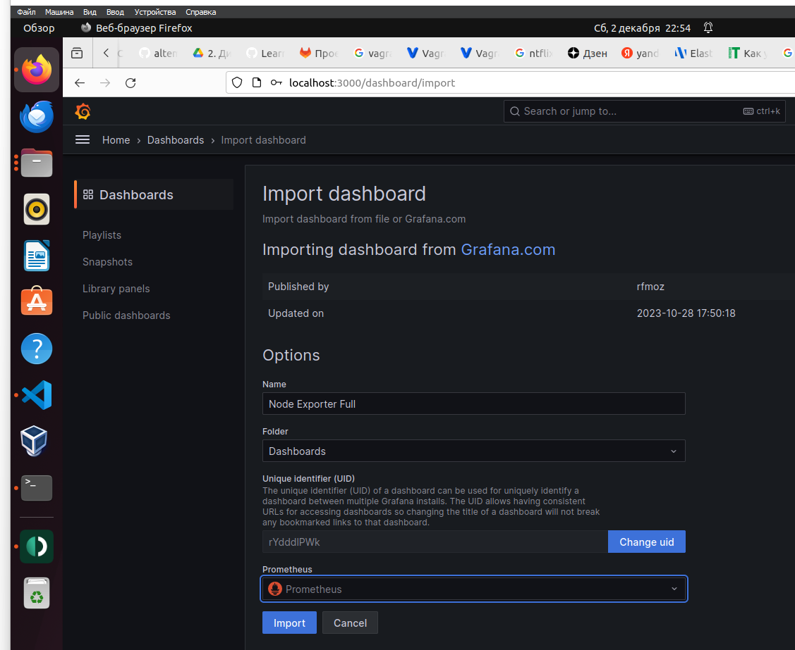

# Home 14 prometheus

<details>
  <summary>Compose</summary>


чтобы не мусорить на виртуалке, будем использовать вариант с докером для запуска тестового мониторинга
создадим docker-compose.yml со следущим содержимым

```
version: '3.9'

services:

  prometheus:
    image: prom/prometheus:latest
    volumes:
      - ./prometheus:/etc/prometheus/
    container_name: prometheus
    hostname: prometheus
    command:
      - --config.file=/etc/prometheus/prometheus.yml
    ports:
      - 9090:9090
    restart: unless-stopped
    environment:
      TZ: "Europe/Moscow"
    networks:
      - default

  grafana:
    image: grafana/grafana
    user: root
    depends_on:
      - prometheus
    ports:
      - 3000:3000
    volumes:
      - ./grafana:/var/lib/grafana
      - ./grafana/provisioning/:/etc/grafana/provisioning/
    container_name: grafana
    hostname: grafana
    restart: unless-stopped
    environment:
      TZ: "Europe/Moscow"
    networks:
      - default
```

так же, на машине, которую будем мониторить создадим композ с node-exporter для сбора метрик

```
version: '3.9'

services:
  node-exporter:
    image: prom/node-exporter
    volumes:
      - /proc:/host/proc:ro
      - /sys:/host/sys:ro
      - /:/rootfs:ro
    container_name: exporter
    hostname: exporter
    command:
      - --path.procfs=/host/proc
      - --path.sysfs=/host/sys
      - --collector.filesystem.ignored-mount-points
      - ^/(sys|proc|dev|host|etc|rootfs/var/lib/docker/containers|rootfs/var/lib/docker/overlay2|rootfs/run/docker/netns|rootfs/var/lib/docker/aufs)($$|/)
    ports:
      - 9100:9100
    restart: unless-stopped
    environment:
      TZ: "Europe/Moscow"
```

Регулировать, какие метрики мы хотим собирать можно в куске команды
```
- ^/(sys|proc|dev|host|etc|rootfs/var/lib/docker/containers|rootfs/var/lib/docker/overlay2|rootfs/run/docker/netns|rootfs/var/lib/docker/aufs)($$|/)
```
убрав или дополнив необходимые метрики.

создадим файл настроек для прометея

```
scrape_configs:
  - job_name: node
    scrape_interval: 5s
    static_configs:
    - targets: ['192.168.1.109:9100']
```

</details>


<details>
  <summary>Запуск</summary>

запускаем композы на нодах

```
docker compose up -d
```

проверяем, что контейнеры запустились

```
altemans@inserv:/opt/common/composes$ docker ps
CONTAINER ID   IMAGE                COMMAND                  CREATED         STATUS         PORTS                                       NAMES
d22e53444dd7   prom/node-exporter   "/bin/node_exporter …"   4 seconds ago   Up 4 seconds   0.0.0.0:9100->9100/tcp, :::9100->9100/tcp   exporter


altemans@Home01:~/otus/home14_prometheus$ sudo docker ps
CONTAINER ID   IMAGE                    COMMAND                  CREATED              STATUS                         PORTS                                       NAMES
d60c111caf8a   grafana/grafana          "/run.sh"                About a minute ago   Up About a minute              0.0.0.0:3000->3000/tcp, :::3000->3000/tcp   grafana
93822a0638d7   prom/prometheus:latest   "/bin/prometheus --c…"   About a minute ago   Restarting (2) 9 seconds ago                                               prometheus
```

видим, что прометей не взлетел, смотрим лог докера

```
root@Home01:~# sudo docker logs prometheus 
ts=2023-12-02T19:23:51.869Z caller=main.go:487 level=error msg="Error loading config (--config.file=/etc/prometheus/prometheus.yml)" file=/etc/prometheus/prometheus.yml err="open /etc/prometheus/prometheus.yml: no such file or directory"

```

забыл, что конфиг прометея по композу должен быть в замапленном каталоге прометея - создал его в корне. Перенесем.

```
altemans@Home01:~/otus/home14_prometheus$ sudo docker ps
CONTAINER ID   IMAGE                    COMMAND                  CREATED          STATUS          PORTS                                       NAMES
d60c111caf8a   grafana/grafana          "/run.sh"                11 minutes ago   Up 11 minutes   0.0.0.0:3000->3000/tcp, :::3000->3000/tcp   grafana
93822a0638d7   prom/prometheus:latest   "/bin/prometheus --c…"   11 minutes ago   Up 4 minutes    0.0.0.0:9090->9090/tcp, :::9090->9090/tcp   prometheus

```

видим, что прометей и графана поднялись


</details>

<details>
  <summary>Настройка</summary>

Загрузим дашборды node exporter  
Для этого сначала добавим источник, указываем http://prometheus:9090, т.к. обращаемся внутри сети докера по имени контейнера.  

Далее, импортируем готовый дашборд node-exporter. Находим его на сайте  
https://grafana.com/grafana/dashboards/1860-node-exporter-full/  
Идем в меню настроек дошборда и в импорте указываем найденный номер 1860, после чего тыкаем загрузить.  
Получаем следующую менюшку, где сразу указываем, к какому источнику мы хотим его привязать



Получаем готовый дашборд с выводом метрик. Отредактируем его название, добавим свое имя и фамилию.


</details>